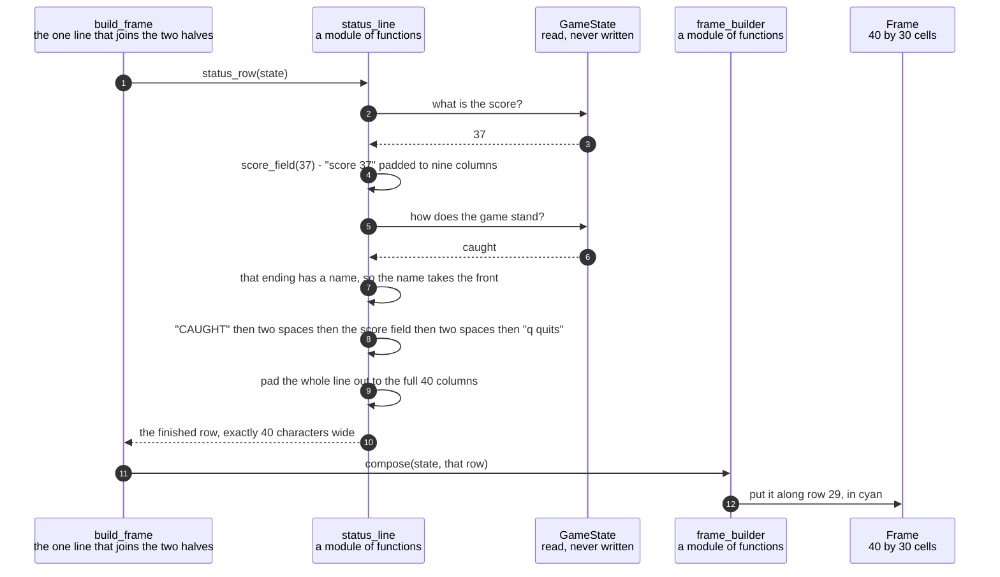

# The status row shows the score and the keys that still work

**Priority: `MEDIUM`** — this is rebuilt for every picture, but a fault in it costs the player information rather than the game. The maze still draws and still plays. What is lost is the only place the score is ever shown, and the only reminder of how to leave. [What the priorities mean](SCENARIO_INDEX.md#what-the-priorities-mean).

The bottom row of the window is not part of the maze. It is one line of cyan text
saying how many dots have been eaten and which keys do anything, and it changes
the moment a game ends. During play it reads:

```
 score 0    arrows, q quits
```

and when the ghost catches the player it reads:

```
CAUGHT  score 37   q quits
```

The specification gives those two lines and one more, and never states a rule for
building them. Working the rule out from the examples is most of what this
document is about, because the rule turns out to be a single sentence that
reproduces all three lines **character for character** — which is the reason to
believe it is the rule they were written from in the first place.

Here it is. **The score is written as `score` followed by the number, padded out
to nine columns, with two spaces between it and whatever comes next.** Nine
columns because the word and its space take six and the number gets three, which
is enough for any score this game can reach — a 19 by 29 maze holds fewer than
three hundred dots, so the widest real score is three digits. During play the line
starts with a single space. On an ending, the ending's name takes the front
instead.

There is also an honest admission in this module, and it is the kind of thing
worth keeping in documentation rather than hiding. The specification shows the
play line **with** a leading space in its picture and quotes the same line
**without** one in the prose. The program keeps the space, for three stated
reasons: the picture is a verbatim block that preserves spacing exactly, where a
quotation inside a sentence is a place a leading space is invisible and easily
lost; the maze's left wall stands at column 0, so the indent lifts the text off
it; and the earliest version of the program already wrote it that way. It is
recorded as an assumption rather than a ruling, and it is [one constant to
change](../../terminalgame/presentation/status_line.py#L65).

| Class | What it represents, and its part in this scenario |
|---|---|
| [`status_line`](../../terminalgame/presentation/status_line.py) | A module of plain functions rather than a class. In this scenario it is the **wording**. [`status_row`](../../terminalgame/presentation/status_line.py#L113) builds the whole row. It draws nothing, knows no terminal, and does not even know which row of the picture it will end up on — that is decided elsewhere |
| [`GameState`](../../terminalgame/domain/game_state.py#L97) | Everything true of a game at one moment. In this scenario it is the **source of both facts the row reports**: the score, and how the game stands. Because the row is built fresh from the state every time, "kept up to date" needs nothing doing to it at all |
| [`Outcome`](../../terminalgame/domain/game_state.py#L60) | How a game stands: playing, caught or cleared. In this scenario it is the **switch between two shapes of sentence**. It has exactly three settings and no fourth, which is why [a table with two entries](../../terminalgame/presentation/status_line.py#L72) and a fall-through covers every case |
| [`frame_builder`](../../terminalgame/presentation/frame_builder.py) | A module of plain functions. In this scenario it is the **placer**. It puts the finished text on row 29 in cyan, [taking it exactly as given, leading spaces and all](../../terminalgame/presentation/frame_builder.py#L193), because what it says is not its business |
| [`game_main`](../../terminalgame/game_main.py) | A module of plain functions. In this scenario it is the **joiner of two halves**. [`build_frame`](../../terminalgame/game_main.py#L59) is one line, and it exists as a named function with a test of its own for a reason given in the closing notes below |

## Two facts becoming one line of cyan text



| Step | Message | What is going on |
|---:|---|---|
| 1 | [`status_row`](../../terminalgame/presentation/status_line.py#L113)`(state)` | Built from scratch for every picture. There is nothing stored, nothing to keep in step, and no way for the number shown to disagree with the number in the game |
| 2 | what is the score? | Read from the state. The score only ever changes in one place in the whole program, and only ever upwards, so a row built from it cannot show something that never happened |
| 3 | `37` | The number the specification's own example uses for a loss |
| 4 | [`score_field`](../../terminalgame/presentation/status_line.py#L88)`(37)` - `"score 37"` padded to nine columns | Padded on the right to a fixed width rather than the number being pushed to the right. That is what reproduces the quoted lines: `score 37` is followed by three spaces before `q quits`, and `score 274` by two. Those look like two different gaps and they are not. They are one field of nine columns, filled to different depths |
| 5 | how does the game stand? | The only other thing this row reports |
| 6 | `caught` | One of three, and there is no fourth |
| 7 | that ending has a name, so the name takes the front | The lookup [has two entries](../../terminalgame/presentation/status_line.py#L72), for the two endings. *Playing* is deliberately not in it: falling through the lookup is what selects the during-play shape, so the two shapes are chosen by one question rather than by two |
| 8 | `"CAUGHT"` then two spaces then the score field then two spaces then `"q quits"` | Requirement STAT-3[^codes]. Note what changes between the two shapes besides the front: during play the keys are `arrows, q quits`, and after an ending they are just `q quits`. That is not decoration. Requirement END-5 says the arrow keys stop doing anything once a game is over, so a row still offering them would be telling the player something untrue |
| 9 | pad the whole line out to the full 40 columns | Padding to the **full width** rather than stopping at the end of the text. The row has to cover whatever was there before it: a shorter line would leave the tail of the previous picture's row sitting on the screen, and the score would appear to have two values at once |
| 10 | the finished row, exactly 40 characters wide | A line that will not fit is [refused rather than trimmed](../../terminalgame/presentation/status_line.py#L78). Trimming would drop the end of the line, and the end of the line is the part that says which keys work — a row that has quietly lost `q quits` is worse than a loud failure, because that is the only way out of a finished game |
| 11 | [`compose`](../../terminalgame/presentation/frame_builder.py#L131)`(state, that row)` | The row is handed **in** to the picture, not fetched by it |
| 12 | put it along row 29, in cyan | Requirement SCRN-1 gives the bottom row to the status line and the 29 above it to the maze, and requirement SCRN-6 makes it cyan. Nothing else in the program writes to row 29 |

The two ending lines do not line up with each other. `q quits` begins one column
further along on a win than on a loss, because `CLEARED` is seven letters and
`CAUGHT` is six. That is left alone on purpose. **A game ends one way, so no
player ever sees both lines**, and alignment between two things that are never on
screen together is not something anybody can observe. Forcing them to agree would
mean departing from a line the specification quotes in order to fix something
nobody can see.

All three quoted lines were checked against the running program and come back
character for character: `' score 0    arrows, q quits'`, `'CAUGHT  score 37   q
quits'` and `'CLEARED  score 274  q quits'`.

One last thing, about why the joining line is a named function. A picture built
with no status row is a perfectly well-formed picture. It composes without
complaint, fills every cell, and passes every check the composing code has — it
simply has a blank bottom row. So forgetting to pass the row would not break
anything loudly. It would produce a game that quietly failed requirement STAT-1
while looking entirely correct to everything automatic. Giving that one line a
name and a test of its own is what turns a silent omission into something that
can fail.

## Related scenarios

- [A game state is composed into a 40 by 30 frame with the ghost drawn last](a-game-state-is-composed-into-a-40-by-30-frame-with-the-ghost-drawn-last.md)
  — the other 29 rows, and the module that takes the text built here and places
  it without reading it.
- [Eating the last dot on the ghost's square is a loss and not a win](eating-the-last-dot-on-the-ghosts-square-is-a-loss-and-not-a-win.md)
  — where the ending named in this row is decided, and why the order in which it
  is decided matters.
- [An arrow key moves the player one square and eats the dot it lands on](an-arrow-key-moves-the-player-one-square-and-eats-the-dot-it-lands-on.md)
  — the only thing in the game that ever changes the number this row shows.

### Footnotes

[^codes]: A **requirement code** is a short name such as `WIN-2` or `GHOST-1`
    given to one sentence of
    [the specification](../FUNCTIONAL_REQUIREMENTS.md). There are 49 of them,
    in ten groups, and the group name says what the sentence is about: `GAME`,
    `WIN` for the window, `SCRN` for what is on screen, `MAZE`, `START`, `CTRL`
    for the controls, `GHOST`, `SCORE`, `END` for how a game finishes, and
    `STAT` for the bottom row. They are quoted throughout the code as well as
    in these documents, so a reader who finds `CTRL-3` in a comment can look up
    the exact sentence it is keeping.
