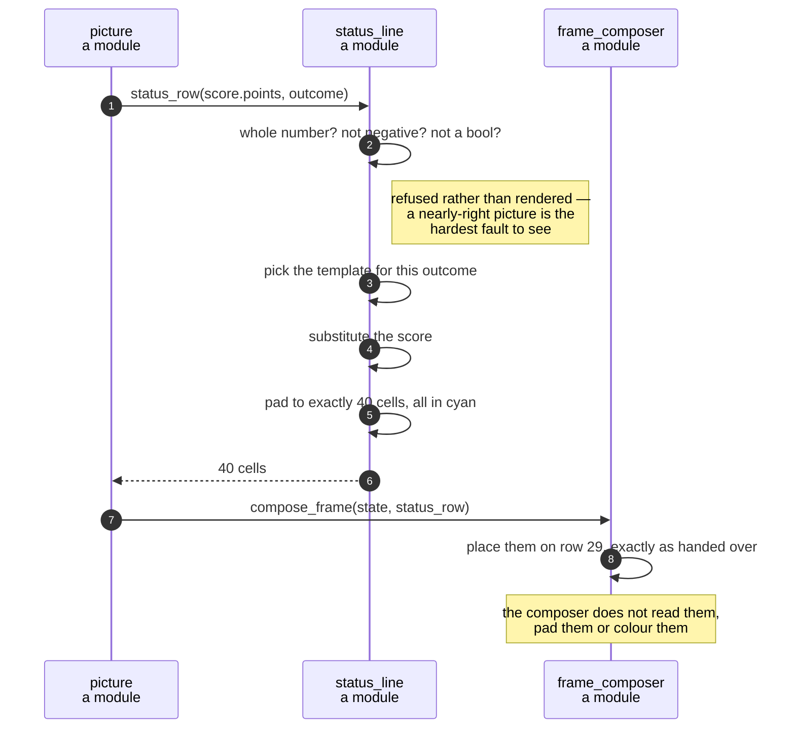

# The status row shows the score and the keys that still work

**Priority: `MEDIUM`** — row 29 is redrawn with every picture, so a fault is seen constantly, but it costs the player information rather than the game. The exception is the ending: STAT-3's line is the only thing on screen that says *which* ending happened. [What the priorities mean](SCENARIO_INDEX.md#what-the-priorities-mean).

SCRN-1[^codes] gives the picture 30 rows: 29 of maze and one beneath. STAT-1 says
that row carries "the score and the keys that can be used, and nothing else".
STAT-2 and STAT-3 quote three lines verbatim:

```
 score 0    arrows, q quits
CAUGHT  score 37   q quits
CLEARED  score 274  q quits
```

Three quoted strings and no stated rule. This module's job is to be the one
place those strings live, and to make them a function of two values — a score
and an outcome — and nothing else.

## Templates rather than a derived rule

[`status_line`](../../terminal_game/presentation/status_line.py) holds the three
lines as templates, one per outcome:

- [`PLAYING_TEMPLATE`](../../terminal_game/presentation/status_line.py#L80)
- [`CAUGHT_TEMPLATE`](../../terminal_game/presentation/status_line.py#L83)
- [`CLEARED_TEMPLATE`](../../terminal_game/presentation/status_line.py#L88)

and a [`_TEMPLATES`](../../terminal_game/presentation/status_line.py#L95)
mapping from outcome to template.

This is worth noticing because the obvious alternative is to *derive* the three
lines from a rule — a score field of fixed width, a gap of two spaces, an
ending name at the front. That rule exists and reproduces all three quoted
lines. It is also a rule nobody wrote down: the specification gives examples,
not a format. A template per outcome cannot drift from the quoted text, because
it *is* the quoted text with one substitution.

The spacing between the three differs — `q quits` starts at a different column
on a loss than on a win — and that is incidental rather than a mistake. A game
ends one way, so no player ever sees two of these lines together, and alignment
between them is unobservable.

## Refusing a score that cannot be one

[`status_text`](../../terminal_game/presentation/status_line.py#L102) refuses a
score that is not a whole number, and refuses a negative one. Its reason is
precise, and it is the reason worth copying:

> the score reaching a status line wrong is the sort of defect that shows up as
> a picture that is nearly right.

A nearly-right picture is the hardest kind of fault to see. `score 3.0` or
`score -1` would render, would look almost correct, and would pass any test
that only checked the row was 40 cells wide. `True` is refused too — it is an
`int` in Python and would print as `score 1`.

## Forty cells, exactly, every time

[`status_row`](../../terminal_game/presentation/status_line.py#L135) turns the
text into exactly 40 cells in
[`STATUS_COLOUR`](../../terminal_game/presentation/status_line.py#L75), padding
the remainder. The full width matters: the row is rewritten in place every
frame, and a short row would leave the tail of the previous frame's line on the
screen. The longest template is 24 characters plus the digits, so no score a
game can reach — a 19 × 29 maze holds fewer than 300 dots — can overflow it.

| Class | What it represents, and its part in this scenario |
| --- | --- |
| [`status_line`](../../terminal_game/presentation/status_line.py) | A module of plain functions. In this scenario it is the **sole owner of three quoted strings** — A7 reserves every status-line literal for it, so no other module may spell one |
| [`Outcome`](../../terminal_game/domain/game_state.py) | Playing, caught or cleared. In this scenario it is **the selector**: it chooses the template and nothing else about the row |
| [`Cell`](../../terminal_game/presentation/frame.py#L84) | A glyph and a colour. In this scenario it is the **unit of the result** — the row is handed upward already coloured, so the composer never chooses cyan |
| [`frame_for`](../../terminal_game/presentation/picture.py#L59) | A module function. In this scenario it is the **only caller in the game**, and the place row 29 is joined to rows 0–28 |



## Related scenarios

- **A game state is composed into a 40 × 30 frame** — where this row is placed,
  and the other 29 rows it sits under.
- **A session goes Playing → Decided → Ended, and only `q` leaves it** — where
  the outcome that selects the template comes from.

### Footnotes

[^codes]: Requirement codes are the specification's own, in
    [`docs/FUNCTIONAL_REQUIREMENTS.md`](../FUNCTIONAL_REQUIREMENTS.md).
    Assumption codes are the architecture's, in
    [`docs/ARCHITECTURE.md`](../ARCHITECTURE.md).
