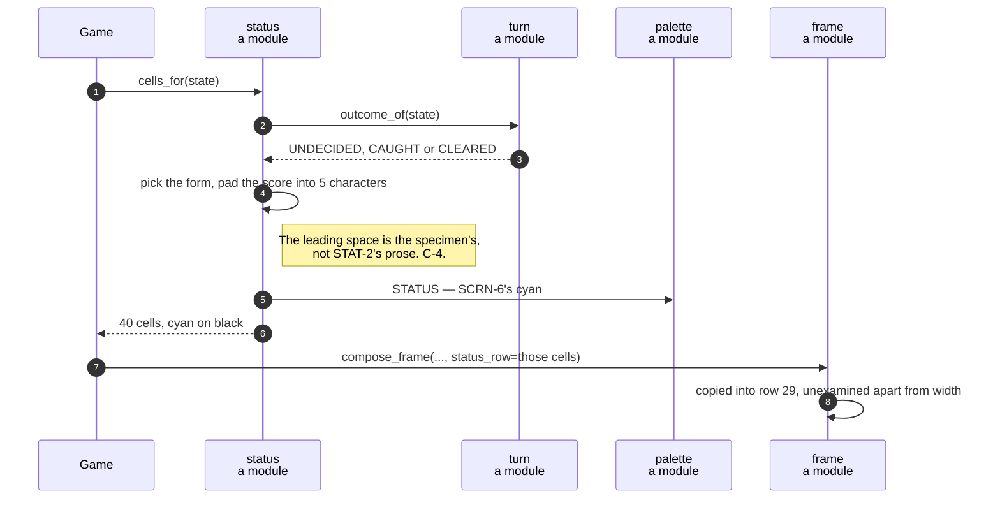

# The status row shows the score and the keys that still work

**Priority: `MEDIUM`** — it is rebuilt on every frame, but a wrong answer misinforms the player rather than stopping the game. [What the priorities mean](SCENARIO_INDEX.md#what-the-priorities-mean).

Row 29. [`status_text`](../../terminal_game/presentation/status.py#L95) produces
the whole row as a string and
[`status_cells`](../../terminal_game/presentation/status.py#L145) as cyan cells.
STAT-1, STAT-2, STAT-3 and SCRN-6[^codes] are all of it.

**The content of row 29 is decided here and nowhere else.** The frame composer
writes the row and decides nothing about it — a status line composed partly in
one place and partly in another is a status line nobody owns.

## Three forms, one for each way a game can stand

```
playing   score 0    arrows, q quits
caught    CAUGHT  score 37   q quits
cleared   CLEARED  score 274  q quits
```

Notice the arrows disappear once the game is decided. That is not decoration: it
is the row telling the truth about what the keys now do, which is what STAT-1's
*"the keys that can be used"* asks for. END-6 says `q` is the only way out of a
decided game, and the row says so.

## Two things recovered by measurement

**The leading space.** Ruling C-4 takes the specimen picture as normative, and
the specimen's bottom row carries a leading space that STAT-2's prose does not.
Measured rather than taken on trust: the row is `' score 0    arrows, q quits'`
— 27 characters, one leading space, and exactly `" " + <the STAT-2 literal>`.

**The column discipline that the ruling said was not there.** C-4 concluded the
three literals *"pad differently from one another … so there is no column
discipline to infer"*. **There is one, and the specification's own three
examples determine it uniquely:**

| Form | Built as | Printed as |
| --- | --- | --- |
| playing, 0 | `score ` + `0    ` | `score 0    arrows, q quits` |
| caught, 37 | `CAUGHT  score ` + `37   ` | `CAUGHT  score 37   q quits` |
| cleared, 274 | `CLEARED  score ` + `274  ` | `CLEARED  score 274  q quits` |

The score sits **left-aligned in a field of five characters**. Width 5
reproduces all three verbatim; width 4 and width 6 each break at least one. So
`SCORE_FIELD_WIDTH = 5` is derived from the specification rather than chosen,
and a reader can check that claim with the three examples in front of them.

This is worth noticing as a pattern rather than as a fact about padding: a
ruling said an inference was impossible, and three worked examples turned out to
determine the answer uniquely. **The ruling was not wrong to be cautious; the
examples simply had more in them than the prose did.**

## Cyan, named twice on purpose

`STATUS_COLOUR` here is `palette.STATUS`. The colour is defined once in the
palette, as every colour is, and re-exported here so that **a caller writing the
row asks this module for everything about the row** — text, cells and colour —
rather than assembling it from two modules and getting one of them wrong.

| Participant | What it represents, and its part in this scenario |
| --- | --- |
| [`status`](../../terminal_game/presentation/status.py) | A module of plain functions. In this scenario it is **the whole of row 29**: its words, its padding and its colour |
| [`Outcome`](../../terminal_game/domain/state.py#L42) | Undecided, caught, cleared. In this scenario it is **which of the three forms applies** |
| [`turn`](../../terminal_game/application/turn.py) | A module. In this scenario it is **where the outcome is asked from** — `status_for` derives it rather than reading the stamped field |
| [`Cell`](../../terminal_game/presentation/field.py#L38) | One glyph and two colours. In this scenario it is **what the row becomes** before the composer writes it |
| [`frame`](../../terminal_game/presentation/frame.py) | A module. In this scenario it is **the caller that places the row and reads none of it** |



## Related scenarios

- **A game state is composed into a 40 × 30 field, three cells to an actor** —
  the caller that places this row.
- **A session goes Playing → Decided → Ended, and only `q` leaves it** — why the
  arrows stop being offered.

### Footnotes

[^codes]: Requirement codes are the specification's own, in
    [`docs/FUNCTIONAL_REQUIREMENTS.md`](../FUNCTIONAL_REQUIREMENTS.md).
