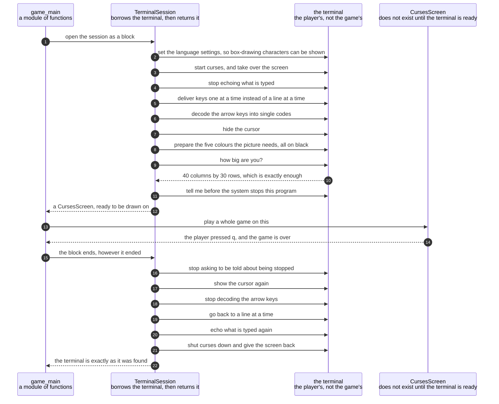

# The terminal is put into raw mode and given back on every way out

**Priority: `HIGH`** — nothing can be drawn or pressed until this has happened, so it is on the only route by which the game can be seen or driven at all. The undoing half matters just as much: a game that leaves without tidying up leaves the player with a terminal they cannot type in. [What the priorities mean](SCENARIO_INDEX.md#what-the-priorities-mean).

Before the first picture appears, the game has to change how the terminal
behaves. Ordinarily a terminal waits for a whole line to be typed and shows each
letter as it is pressed. A game cannot work like that. It needs each key the
instant it is pressed, it must not print anything the player types, and it wants
the blinking cursor out of the way.

All of those are switched **off**, and something switched off has to be switched
back on. That is the real subject of this document. The terminal does not belong
to the game. It belongs to the player, and it is borrowed. If the game stops
without giving it back, the player is left with a terminal that echoes nothing
and shows no cursor — a shell that looks broken and, to somebody who does not
know what happened, is indistinguishable from one that is.

The arrangement that makes the giving-back reliable is worth stating as a rule,
because it is the whole design: **the borrowing and the returning are written as
one thing, not as two.** [`TerminalSession`](../../terminalgame/screen/curses_adapter.py#L166)
is used as a block with a beginning and an end, and Python guarantees that the
end runs however the block is left — by finishing, by an error nobody expected,
or by the player interrupting. There is no path through the game where the
tidying-up is a separate step that somebody has to remember.

That still leaves one way out that a block cannot catch. A program can be told
to stop by the system itself, and when that happens none of its endings run at
all. So the session also asks to be told about two of those instructions,
tidies up when one arrives, and only then lets the program die. This is caution
C10[^cautions], and it is the one place in the game where a signal is handled.

| Class | What it represents, and its part in this scenario |
|---|---|
| [`TerminalSession`](../../terminalgame/screen/curses_adapter.py#L166) | Raw mode[^rawmode] for exactly as long as the game runs, and not one moment longer. In this scenario it is the **borrower**. [`open`](../../terminalgame/screen/curses_adapter.py#L208) makes every change, and [`close`](../../terminalgame/screen/curses_adapter.py#L236) undoes every one of them. `close` is written so that it can be called twice without complaint, because it often is |
| [`CursesScreen`](../../terminalgame/screen/curses_adapter.py#L58) | The one object in the game that can actually put something on a terminal or read a key from one. In this scenario it is the **thing being handed over**. It does not exist until the terminal is ready and the size has been checked, which is why no part of the game can draw on a terminal that was never prepared |
| [`Screen`](../../terminalgame/screen/port.py#L314) | The port[^port]: three operations and a size, and no mention of a terminal anywhere in it. In this scenario it is the **shape of the promise**. Everything above it — the game loop, the pictures, the rules — is written against this and has no idea that `curses`[^curses] exists |
| [`game_main`](../../terminalgame/game_main.py) | A module of plain functions rather than a class. In this scenario it is the **opener and closer of the whole game**. [`main`](../../terminalgame/game_main.py#L80) writes the session as a block with the entire game inside it, so that there is exactly one place where the terminal is borrowed and exactly one shape of code that gives it back |

## Borrowing the terminal, and the four ways of giving it back

| Step | Message | What is going on |
|---:|---|---|
| 1 | open the session as a block | Written as a block on purpose. Everything from here to the end of the list runs whatever happens inside, including an error nobody predicted. That is the whole reason the tidying-up can be trusted, and it is why [`main`](../../terminalgame/game_main.py#L80) puts the entire game inside one of these rather than calling an opening step and a closing step |
| 2 | set the language settings, so box-drawing characters can be shown | This has to come **first**, before the screen library is started. Without it the library will not put a double-line wall character on the screen at all, because those characters take more than one byte to write down. Set it afterwards and it is too late |
| 3 | start curses, and take over the screen | From this instant the terminal is changed and somebody has to change it back. Everything after this point is inside a guard: if any of the next steps fails, the session tidies up and **then** reports the failure, so a half-prepared terminal is never left behind |
| 4 | stop echoing what is typed | Requirement CTRL-5[^codes] — "nothing typed is echoed into the maze". Without this, pressing a key would print a letter on top of the picture |
| 5 | deliver keys one at a time instead of a line at a time | Ordinarily a terminal collects a whole line and hands it over when the player presses return. A game needs the key now. This is what makes an arrow key do something the moment it is pressed |
| 6 | decode the arrow keys into single codes | An arrow key does not arrive as one character. It arrives as a short burst of several, beginning with an escape. Asking the library to gather those up means the game gets one code for "up" and never has to know what the burst looked like. That knowledge stops here and never travels any further into the game |
| 7 | hide the cursor | Requirement SCRN-7 — "the text cursor is never visible". A terminal that cannot hide its cursor is [not treated as a reason to refuse to play](../../terminalgame/screen/curses_adapter.py#L263). The picture is slightly worse and the game is entirely playable, which is the right trade for something no player can fix |
| 8 | prepare the five colours the picture needs, all on black | Blue walls, dim gold dots, bright yellow player, pink ghost, cyan status row. An eight-colour terminal has no gold and no pink, so [dim yellow stands for gold and bold magenta for pink](../../terminalgame/screen/curses_adapter.py#L41) — which is what those two actually look like on a terminal. A terminal with no colour at all is handled the same way as a missing cursor: the game plays, in one colour |
| 9 | how big are you? | Asked once, here, and never again during a game |
| 10 | 40 columns by 30 rows, which is exactly enough | The picture is exactly 40 by 30, so there is no margin for a smaller terminal to eat into. What happens when the answer is too small has a scenario of its own, listed below |
| 11 | tell me before the system stops this program | The one way out that a block cannot catch. Two instructions are asked about, listed in [`FATAL_SIGNALS`](../../terminalgame/screen/curses_adapter.py#L38). The player's own interrupt key is deliberately **not** among them, because Python already turns that into an ordinary error that the block's ending handles perfectly well. Asking about it too would be a second answer to a question that already has one |
| 12 | a `CursesScreen`, ready to be drawn on | The object that can draw does not exist until every step above has succeeded. That ordering is the guarantee: there is no way to hold something that can draw on a terminal that was never prepared, because the only place one is made is at the end of the preparing |
| 13 | play a whole game on this | The entire game happens here — every key, every tick of the clock, every picture. It is one line in this document because from the terminal's point of view it is one thing: a long stretch during which the terminal is borrowed |
| 14 | the player pressed `q`, and the game is over | The ordinary ending. There are three others, and the point of this document is that the rest of the list does not care which happened: an error nobody expected, the player interrupting, and the system stopping the program all arrive at the same steps |
| 15 | the block ends, however it ended | The ending [never swallows an error](../../terminalgame/screen/curses_adapter.py#L204). It gives the terminal back and then lets the error carry on. Hiding the error would mean a game that failed silently and a player with no idea why it stopped |
| 16 | stop asking to be told about being stopped | Undone first, and in the opposite order to the setting-up, so that nothing is left pointing at a session that has already gone |
| 17 | show the cursor again | Each of the undoing steps is [guarded on its own](../../terminalgame/screen/curses_adapter.py#L257). A terminal that refuses one of them must not stop the others from running. Giving back four things out of five is very much better than giving back none, and the one that refuses is usually the cursor, which is the least important of them |
| 18 | stop decoding the arrow keys | Undone so that the shell the player returns to reads an arrow key the way a shell expects to, rather than as a code meant for a game |
| 19 | go back to a line at a time | The terminal goes back to collecting a whole line before handing it over, which is what a shell prompt needs in order to let somebody correct a typing mistake before pressing return |
| 20 | echo what is typed again | This is the one that a player would notice immediately if it were missed. A shell that shows nothing as you type looks broken even though it is working perfectly |
| 21 | shut curses down and give the screen back | The last step, and the one that puts the player's own scrollback and prompt back on the screen |
| 22 | the terminal is exactly as it was found | Which is the promise this document exists to describe |

This diagram has no coloured bands. The game has one thread and no locks
anywhere in it, so there is no boundary to mark. That is worth saying rather
than leaving to be noticed: the two things happening at once in this game — a
player pressing keys and a ghost moving on a clock — are reconciled by
arithmetic instead, which is the subject of its own scenario below.

One thing is deliberately **not** in this list. Nothing here closes the window.
The game does not know it is in a window the program opened, and it never
touches the desktop. That is caution C11, and it is why the game and the
launcher are two separate programs that share no code at all.

## Related scenarios

- [A terminal too small to hold the picture is refused before a game starts](a-terminal-too-small-to-hold-the-picture-is-refused-before-a-game-starts.md)
  — the same cast reaching the measuring step and getting an answer that will
  not do. The same tidying-up runs, which is what makes the refusal readable.
- [A whole frame is written to the terminal and made visible in one pass](a-whole-frame-is-written-to-the-terminal-and-made-visible-in-one-pass.md)
  — what the object handed over in the middle of this document is then used for,
  several times a second, for the whole length of a game.
- [The launcher closes the window it created, once nothing is running in it](the-launcher-closes-the-window-it-created-once-nothing-is-running-in-it.md)
  — what happens on the other side of the process boundary once this session has
  finished and the game's program has ended.

### Footnotes

[^codes]: A **requirement code** is a short name such as `WIN-2` or `GHOST-1`
    given to one sentence of
    [the specification](../FUNCTIONAL_REQUIREMENTS.md). There are 49 of them,
    in ten groups, and the group name says what the sentence is about: `GAME`,
    `WIN` for the window, `SCRN` for what is on screen, `MAZE`, `START`, `CTRL`
    for the controls, `GHOST`, `SCORE`, `END` for how a game finishes, and
    `STAT` for the bottom row. They are quoted throughout the code as well as
    in these documents, so a reader who finds `CTRL-3` in a comment can look up
    the exact sentence it is keeping.

[^cautions]: A **caution** is a numbered warning in
    [the architecture document](../ARCHITECTURE.md), written before any code
    existed, about something known to be easy to get wrong — `C1` is "never act
    on the front window", `C9` is "redraw the whole frame each pass, not dirty
    cells". Each names one specific way this program could break rather than
    giving general advice, and several of them are quoted in the code at the
    exact line that obeys them.

[^rawmode]: **Raw mode** is the name for a terminal that has been told to stop
    being helpful. Normally a terminal collects a whole line before handing it
    over, prints each letter as it is typed, and watches for a few special keys
    itself. In raw mode it does none of that: every key press is handed straight
    to the program and nothing is printed unless the program prints it. A game
    needs all three of those changes, and all three have to be undone before the
    player gets their terminal back.

[^curses]: **curses** is a library that comes with the system for drawing at
    chosen positions on a terminal, in colour, rather than only printing at the
    bottom. It also gathers up the several characters an arrow key really sends
    and reports them as one. Exactly one module of this game
    [uses it](../../terminalgame/screen/curses_adapter.py#L58), and
    everything else speaks to the port instead, which is what lets the rest of
    the game be checked with no terminal anywhere near it.

[^port]: The **screen port** is the small set of things the game is allowed to
    ask of a screen: how big are you, give me a blank picture, show this picture,
    and wait a stated length of time for a key. It is
    [`Screen`](../../terminalgame/screen/port.py#L314), and it names those three
    operations plus the size, and nothing else. A **port** in this sense is a boundary written
    as a list of operations, with the real implementation kept on the far side
    of it, so that everything on the near side can be exercised by standing
    something simpler in its place.
