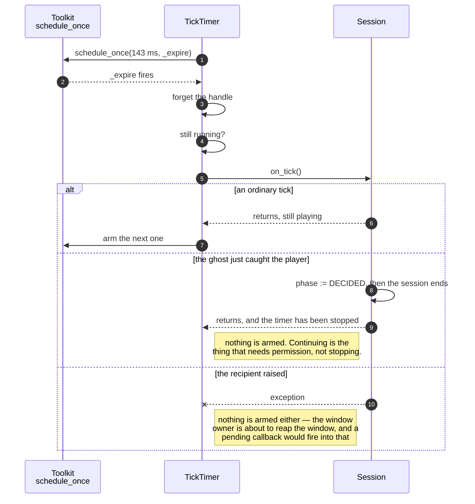

# The tick timer keeps the ghost's beat, and stops cleanly when a tick ends the game

**Priority: `HIGH`** — this is the only clock in the game. It runs for the whole of every session, it is what makes the ghost move whether the player does or not, and a fault here either freezes the ghost or leaves a callback firing into a half-dead session. [What the priorities mean](SCENARIO_INDEX.md#what-the-priorities-mean).

GHOST-1[^codes] asks that the ghost move "one square at a time about seven times
a second, whether or not the player is moving". That sentence contains the
program's only timing requirement, and
[`cadence`](../../terminal_game/shell/cadence.py) contains the program's only
answer to it — sixteen lines, two constants, and the arithmetic written out:

```python
GHOST_TICKS_PER_SECOND = 7
# 1000 / 7 is 142.857..., so 143 ms is the nearest millisecond: 6.993 ticks a second.
TICK_INTERVAL_MS = 143
```

"About seven" is satisfied at 6.993. Stating it in one module means nothing
else has to guess, and means the rounding is visible rather than buried in a
call site.

## Delivering first and arming second

[`TickTimer`](../../terminal_game/shell/tick_timer.py#L15) schedules one tick at
a time rather than repeating. The whole of the interesting behaviour is the
order of four lines in
[`_expire`](../../terminal_game/shell/tick_timer.py#L71):

```python
def _expire(self) -> None:
    self._handle = None
    if not self._running:
        return
    self._on_tick()
    if self._running:
        self._arm()
```

The tick is delivered, and the next is armed **only if the timer is still
running afterwards**. The class docstring names both consequences, and they are
different problems:

- **If the recipient raises, nothing is left scheduled.** The window owner is
  about to take the window away, and a callback pointing at a half-dead session
  would fire in the middle of that.
- **If the recipient ends the session** — which it may, since a tick is how the
  ghost catches the player — the timer notices it has been stopped, and does not
  arm another.

That second case is the one that would be easy to get wrong. A timer that armed
the next tick *before* delivering the current one would keep ticking into a
finished game, and the `is_over` guards in the domain would absorb every one of
them silently. The game would look correct and would never stop scheduling.

## Why a re-armed one-shot rather than a repeating timer

A repeating timer keeps firing until something cancels it, which puts the
responsibility for stopping in whichever code notices the game ended. A
re-armed one-shot puts it in the timer: **not arming is the default, and
continuing is the thing that requires the session still to be running.**

The cost is that a tick's own duration is added to the interval rather than
absorbed by it, so the beat is nominally slower than 143 ms by however long a
tick takes. Measured during the run that built this, a full first paint was
5.6 ms and a player move 0.68 ms against a 143 ms budget — under half a percent
— so the drift is real and immaterial.

| Class | What it represents, and its part in this scenario |
| --- | --- |
| [`TickTimer`](../../terminal_game/shell/tick_timer.py#L15) | A one-shot re-armed after each delivery. In this scenario it is **the metronome**, and its correctness is entirely the order of four lines |
| [`cadence`](../../terminal_game/shell/cadence.py) | Two constants and the arithmetic between them. In this scenario it is **the single statement of GHOST-1**, so that no other module rounds 1000/7 for itself |
| [`Toolkit`](../../terminal_game/shell/toolkit.py) | `schedule_once` and `cancel_scheduled`. In this scenario it is **the seam to the real clock**, and the reason the whole of this can be tested with a fake that never sleeps |
| [`Session`](../../terminal_game/application/session.py) | The game as a state machine. In this scenario it is **the recipient**, and the thing that may end during the very call that delivers a tick |



## Related scenarios

- **A clock tick moves the ghost, which is never told where the player is** —
  what `on_tick` does.
- **The window closes itself when the session ends, and the session learns that
  it did** — what happens after the tick that ends a game.
- **A frame is painted onto the grid, touching only the cells that changed** —
  the work a tick causes, and the measurement that makes the drift immaterial.

### Footnotes

[^codes]: Requirement codes are the specification's own, in
    [`docs/FUNCTIONAL_REQUIREMENTS.md`](../FUNCTIONAL_REQUIREMENTS.md).
