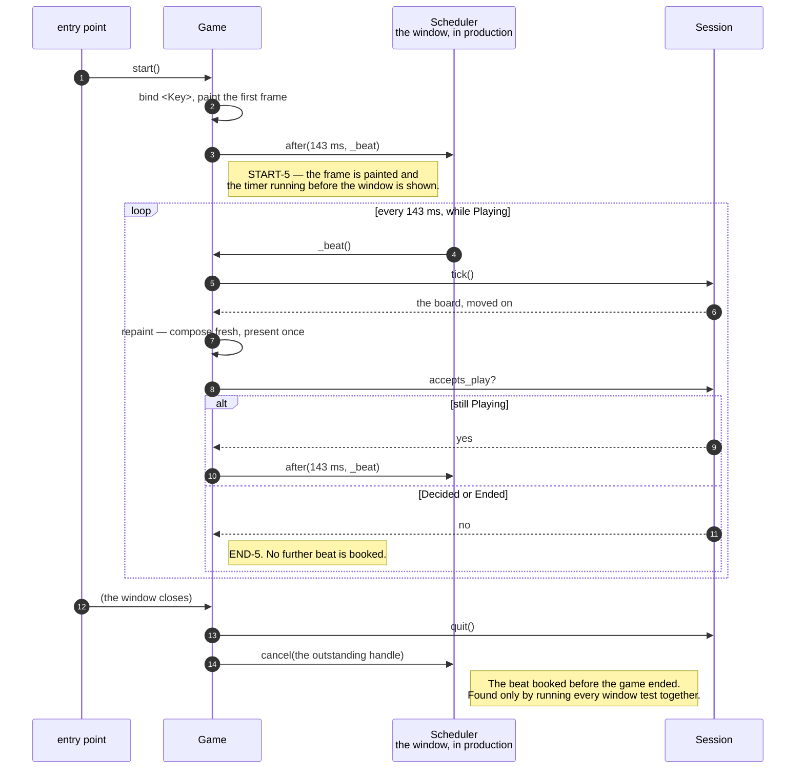

# The tick timer keeps the ghost's beat, and stops when the game is decided

**Priority: `HIGH`** — it is the clock the whole game runs on, and a beat left scheduled after a game ends is a defect that survived every default test. [What the priorities mean](SCENARIO_INDEX.md#what-the-priorities-mean).

GHOST-1[^codes] says the ghost moves *"about seven times a second"*.
[`CADENCE_MS`](../../terminal_game/shell/game.py#L51) is 143 milliseconds, which
is 6.99 moves a second — **a named constant rather than a number in a call,
because "about" is a judgement somebody made once and should be able to find
again.**

## One beat books the next

```python
def _beat(self):        # what the timer calls
    self.tick()
    self._schedule()

def _schedule(self):
    self._handle = None
    if not self._session.accepts_play:
        return                       # END-5: no further beat is booked
    self._handle = self._scheduler.after(self._cadence_ms, self._beat)
```

There is no repeating timer. Each beat asks for the next one, **and declines
when the session has stopped accepting play.** A timer still firing into a
decided game would be a tick that moves nothing, forever.

[`Game.start`](../../terminal_game/shell/game.py#L150) is idempotent for a
related reason: an entry point and a test must not be able to start the timer
twice between them and double the ghost's speed.

## The clock is injectable, and that was measured rather than hoped for

[`Scheduler`](../../terminal_game/shell/game.py#L54) is two methods — schedule
one call, cancel it. [`GameWindow`](../../terminal_game/shell/window.py#L81)
satisfies it already, so production passes nothing and the window's own `after`
is used; a test passes its own and **the game runs with no real time passing at
all**.

Notice what the protocol does *not* have: no notion of now, no repeating timer,
no cancel-everything. A narrow seam is a seam a test double cannot get subtly
wrong.

[`Game.tick`](../../terminal_game/shell/game.py#L184) is public and callable
directly, so a whole game can be driven beat by beat with nothing on the screen.
And a measurement makes even the real loop testable: **`mainloop()` runs on a
withdrawn root, `after` callbacks fire inside it, and `quit()` returns from it —
with nothing ever reaching the glass.**

## The beat that outlived the game

`_schedule` only declines to book the *next* beat, and it runs **after a beat**
rather than after a quit. So a game that ends between two beats — by `q`, or by
the close button — leaves one scheduled beat outstanding that nothing else ever
clears.

Left alone, `timer_is_running` goes on reporting `True` for a game that is over,
and on a shared Tk interpreter, which is what a test suite has, **the pending
`after` is still live and still fires.**

The fix is one line in
[`_on_window_closed`](../../terminal_game/shell/game.py#L358): the window
closing quits the session *and* stops the game.

**It was found by the full-window run**, the first to execute all ten
`needs_window` tests together — nothing in the default suite could have seen it,
because the defect lives in the assembly's shutdown path. That is the whole
argument for making that run somebody's requirement rather than an optional
extra.

## Repainting is a pure function of the board

[`repaint`](../../terminal_game/shell/game.py#L193) composes the picture fresh
from the session's board every time rather than mutating the last one. **There
is then no way for the screen to remember something the board has forgotten** —
the picture cannot drift from the state, because it is not kept.

| Participant | What it represents, and its part in this scenario |
| --- | --- |
| [`Game`](../../terminal_game/shell/game.py#L90) | The assembly. In this scenario it is **the timer's owner** — it books beats, cancels them, and repaints after each |
| [`Scheduler`](../../terminal_game/shell/game.py#L54) | Two methods. In this scenario it is **the seam that makes the clock injectable**, and the reason a whole game fits in a unit test |
| [`GameWindow`](../../terminal_game/shell/window.py#L81) | The window. In this scenario it is **the production scheduler**, satisfying the protocol without being told about it |
| [`Session`](../../terminal_game/application/session.py#L85) | The game being played. In this scenario it is **what decides whether another beat is wanted**, through `accepts_play` |



## Related scenarios

- **A tick moves the ghost, which is never told where the player is** — what a
  beat actually does.
- **A session goes Playing → Decided → Ended, and only `q` leaves it** — what
  `accepts_play` is answering from.
- **The window closes itself when the session ends, and the process runs out of
  work** — the other half of the outstanding-beat fix.

### Footnotes

[^codes]: Requirement codes are the specification's own, in
    [`docs/FUNCTIONAL_REQUIREMENTS.md`](../FUNCTIONAL_REQUIREMENTS.md).
