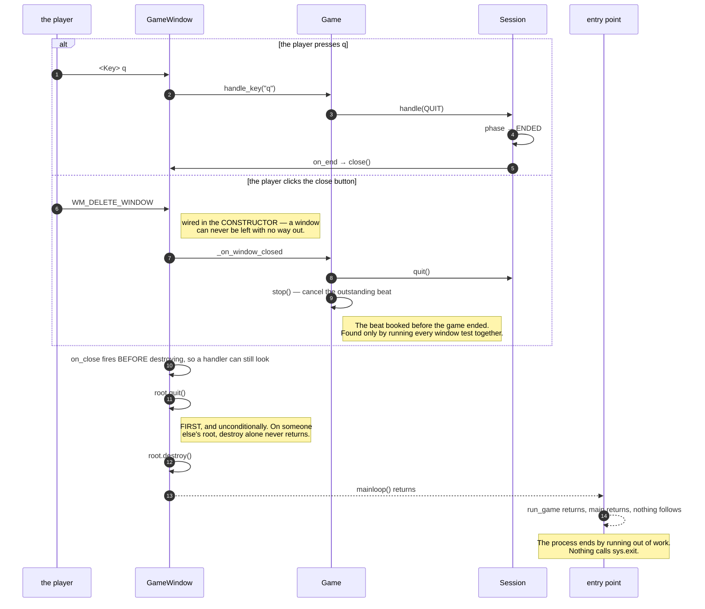

# The window closes itself when the session ends, and the process runs out of work

**Priority: `HIGH`** — it is the only way the program ends, and getting it wrong leaves a window on somebody's desk or a process that will not die. [What the priorities mean](SCENARIO_INDEX.md#what-the-priorities-mean).

WIN-5[^codes]: *"the window closes by itself as soon as the game ends."*

**If you read one document in this folder, read this one.** Not because the
code is hard, but because the same mistake was found three times in one run in
three disguises, and the rule that came out of it transfers.

## Nothing calls `sys.exit`, and that is the design

```
Session reaches ENDED  →  on_end fires  →  GameWindow.close()
                                              ↓
                              root.quit(), then root.destroy()
                                              ↓
                                  mainloop() returns
                                              ↓
                       run_game() returns, main() returns,
                             nothing follows, the process ends
```

[`close`](../../terminal_game/shell/window.py#L266) destroys the toplevel;
destroying the toplevel is what makes
[`run`](../../terminal_game/shell/window.py#L310) return; and when the entry
point's call to `run` returns **there is nothing left to do.**

Calling `sys.exit` in there would end the process in the middle of a test as
readily as in the middle of a game, and would make WIN-5 impossible to check
without a subprocess. **Ending by running out of work is both the honest
mechanism and the testable one.**

## `quit()` before `destroy()`, and unconditionally

This looks like belt and braces and is not. `mainloop` belongs to the Tk
**interpreter**, not to a window.

- When this object owns the interpreter, destroying its root is enough to end
  the loop.
- When it does **not** — a toplevel on somebody else's root, which is what a
  test suite has — destroying it leaves the interpreter running and
  **`mainloop` never returns**: a window gone from the screen and a process
  that will not end.

That was found by hitting it: a windowed test run hung with a window on the
screen until it was killed. Quitting first makes the guarantee **true
regardless of who constructed the window**, rather than true in production and
documented everywhere else.

## Three ways in, all idempotent, and they call each other

A quit can arrive from the `q` key, from the window manager's close button, or
from the session deciding it is over. All three converge, and both
[`Session.quit`](../../terminal_game/application/session.py#L192) and
`GameWindow.close` do nothing on a second call — **so the two calling each
other settles at once instead of looping.**

The close button is wired **in the window's constructor**, which gives a
guarantee worth stating on its own: *a window can never be left with no way out
even if its owner binds nothing at all.* The walking skeleton leans on that
explicitly, and it is what plan section 1.5 forbids being without — a
`mainloop` with no exit.

## The defect that came back three times

**A window closing correctly while the session never learns it is over** was
found three times in one run, in three disguises: a close button that ended the
window with the session still nominally playing; a swallowed crash; and a
scheduled beat outstanding after the game had ended.

The last one is worth following because of how it hid.
[`Game._schedule`](../../terminal_game/shell/game.py) only declines to book the
*next* beat, and it runs **after a beat** rather than after a quit. So a game
that ends between two beats leaves one scheduled that nothing clears — and on a
shared Tk interpreter the pending `after` is still live and still fires.

[`_on_window_closed`](../../terminal_game/shell/game.py#L358) is the fix, and it
does two things rather than one: it quits the session *and* stops the game's
timer.

**It was found by the full-window run**, the first to execute all ten
`needs_window` tests together. Nothing in the default suite could have seen it,
because it lives in the assembly's shutdown path. The ruling that made that run
somebody's requirement — on the argument that excluded tests rot because nobody
pays the cost of running them — found a real defect on its first attempt.

## The rule to take away

> **Assert the phase the session reached, not that the window closed.**

A test that checks the window is gone passes in every one of the three
disguises above. A test that checks `session.phase is Phase.ENDED` fails in all
three. The window disappearing is the *symptom* of the game ending; asserting
the symptom is how a defect survives a suite that looks thorough.

## One deliberate non-requirement

[`run_game`](../../terminal_game/shell/game.py#L388) accepts a `watchdog_ms`
that closes the window unconditionally after a while. **It is not set in
production** — a game that closed itself on a timer would be a time limit, and
GAME-3 forbids one. It exists so that a test which maps a real window cannot
leave one on somebody's desk.

| Participant | What it represents, and its part in this scenario |
| --- | --- |
| [`GameWindow`](../../terminal_game/shell/window.py#L88) | The one window. In this scenario it is **WIN-5**, and the guarantee that there is always a way out |
| [`Session`](../../terminal_game/application/session.py#L85) | The game being played. In this scenario it is **what must learn that it is over**, and the thing a test should assert about |
| [`Game`](../../terminal_game/shell/game.py#L90) | The assembly. In this scenario it is **what wires the two together**, and what stops the outstanding beat |
| [`Phase`](../../terminal_game/application/session.py#L60) | Playing, Decided, Ended. In this scenario it is **the assertion that catches all three disguises** |



## Related scenarios

- **A session goes Playing → Decided → Ended, and only `q` leaves it** — the
  phase this scenario says to assert.
- **The tick timer keeps the ghost's beat, and stops when the game is decided** —
  the outstanding beat, from the timer's side.
- **The window is opened withdrawn, dressed, placed, and only then shown** — the
  other end of this window's life.

### Footnotes

[^codes]: Requirement codes are the specification's own, in
    [`docs/FUNCTIONAL_REQUIREMENTS.md`](../FUNCTIONAL_REQUIREMENTS.md).
