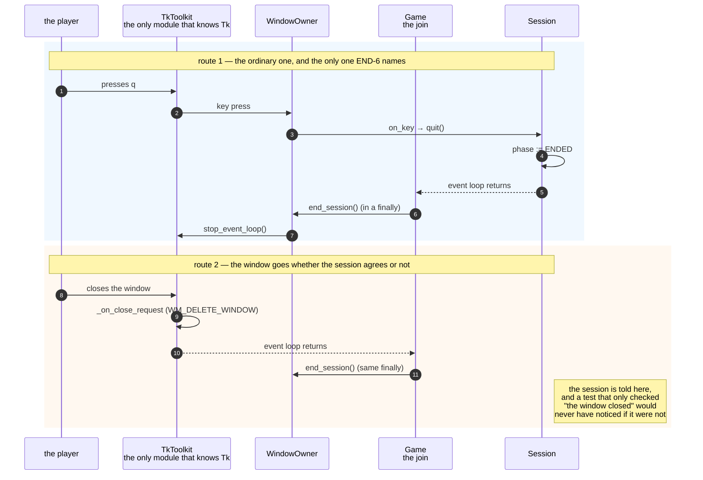

# The window closes itself when the session ends, and the session learns that it did

**Priority: `HIGH`** — this is the only way the program stops. Every game reaches it, by one of three routes, and a fault here is not cosmetic: the window vanishes and the process either hangs with no window, or exits reporting a game that never finished. It is also the one place where a defect appeared three times in a single run wearing three different disguises. [What the priorities mean](SCENARIO_INDEX.md#what-the-priorities-mean).

Requirement WIN-5[^codes] asks that the window "closes by itself as soon as the
game ends". END-5 says the last picture stays on screen and everything stops.
END-6 says `q` is the only way to leave a finished game. Those three sentences
do not obviously agree, and the reading this program was built on is recorded as
assumption A3: the outcome is decided, the final picture stands, the player
presses `q`, the process exits, and **the window closes without the player
having to close it**.

So there is a handover at the end of every game, and it runs in one direction.
The [`Session`](../../terminal_game/application/session.py#L101) decides that
the game is over; the
[`WindowOwner`](../../terminal_game/shell/window_owner.py#L68) takes the window
away. The Application layer may not name the Shell — the layer rule forbids it,
and rule 6 in [`tests/house_rules.py`](../../tests/house_rules.py) now enforces
it for every layer and not only the Domain — so the session cannot close a
window, and does not know there is one.

## Three routes in, and the third is the one that cost a run

A session can end three ways, and the whole difficulty is that they do not all
arrive through the same door.

1. **The player presses `q`.** The key crosses the seam, becomes an intent, and
   [`Session.quit`](../../terminal_game/application/session.py#L259) is called.
   This is the ordinary route and the only one END-6 names.
2. **The player closes the window.** Tk delivers this to
   [`_on_close_request`](../../terminal_game/shell/tk_toolkit.py#L128), which is
   registered at construction as `WM_DELETE_WINDOW`
   ([`tk_toolkit.py:76`](../../terminal_game/shell/tk_toolkit.py#L76)). The
   window is going away whether the session agrees or not.
3. **Something raises.** A composer or a surface throws mid-tick.
   [`Game.run`](../../terminal_game/shell/game.py#L274) does not re-raise: it
   records the failure and lets the caller read
   [`failure`](../../terminal_game/shell/game.py#L236) and
   [`exit_code`](../../terminal_game/shell/game.py#L241) afterwards.

**All three close the window correctly. Only the first tells the session
anything.** That is the shape of the defect, and it is worth naming precisely
because it is not a bug in any one of these three functions — each does its own
job properly. The fault is in what a test then asserts.

> A faithful route and an unconditional route are not the same route.

A test that asserts *the window closed* passes on all three. A test that asserts
*the session reached `Phase.ENDED`* passes only on the routes that actually told
it. The run that built this program found the same defect three times — the
close button, a swallowed crash, and a scheduled deadline — and each time the
window had closed and the session had not been told. Every one of them was found
on a real screen, and every one of them was catchable with no screen at all.

The rule the program now holds itself to:

> **Assert the phase the session reached, not that the window closed.**

You can see it applied in the suite:
[`test_game.py:266`](../../tests/test_game.py#L266) and
[`test_scripted_game.py:210`](../../tests/test_scripted_game.py#L210) both assert
`Phase.ENDED` rather than counting windows.

## Closing exactly once

The other half of this scenario is that the window must be taken away **once**,
however many routes tried to take it away.
[`WindowOwner`](../../terminal_game/shell/window_owner.py#L68) keeps a single
flag, `_session_ended`
([`window_owner.py:101`](../../terminal_game/shell/window_owner.py#L101)), and
[`end_session`](../../terminal_game/shell/window_owner.py#L163) returns
immediately if it is already set. `Game.run` calls `end_session` in a `finally`,
so it runs on the failure path as well as the ordinary one — and because the
flag makes the call idempotent, a session that had already quit does not ask for
a second shutdown.

`Session.quit` has the matching property at its own end: it is honoured in every
phase, and quitting an already-ended session does nothing. That is what makes
`q` the only way out of a finished game *and* harmless to press twice.

| Class | What it represents, and its part in this scenario |
| --- | --- |
| [`Session`](../../terminal_game/application/session.py#L101) | The game as a state machine — `PLAYING`, `DECIDED`, `ENDED`, and [GAME-3 says no more](../../terminal_game/application/session.py#L102). In this scenario it is the **only authority on whether the game is over**. It cannot see a window and must not be able to |
| [`WindowOwner`](../../terminal_game/shell/window_owner.py#L68) | Creates the window, drives it, and closes it exactly once. In this scenario it is the **hand on the door**. It knows nothing about mazes and does not draw |
| [`SessionCollaborator`](../../terminal_game/shell/window_owner.py#L53) | A structural protocol, not a base class — the Application layer may not name the Shell, so the session cannot be asked to inherit from it. In this scenario it is **the shape of the seam**, and the reason the two halves can be tested apart |
| [`Game`](../../terminal_game/shell/game.py#L274) | Holds the session and the owner together. In this scenario it is the **join**, and the `finally` in `run` is the thing that makes the close unconditional |
| [`TkToolkit`](../../terminal_game/shell/tk_toolkit.py#L128) | The only module that knows Tk exists. In this scenario it is **the route the player can take that the session did not choose** — the close button |

## Related scenarios

- **A session goes Playing → Decided → Ended, and only `q` leaves it** — what the
  phases mean, and why there is no `PAUSED`.
- **A key press becomes an intent, and an unknown key becomes nothing** — how `q`
  gets from the keyboard to `Session.quit`.
- **A window is opened, dressed, and placed where the player was looking** — the
  other end of this window's life.

### Footnotes

[^codes]: Requirement codes are the specification's own, in
    [`docs/FUNCTIONAL_REQUIREMENTS.md`](../FUNCTIONAL_REQUIREMENTS.md).
    Assumption codes are the architecture's, in
    [`docs/ARCHITECTURE.md`](../ARCHITECTURE.md). A3 is the reading of WIN-5
    against END-5 and END-6 described above; it is an assumption rather than a
    ruling, and [`docs/TRACEABILITY.md`](../TRACEABILITY.md) §13 records it as
    still open.
